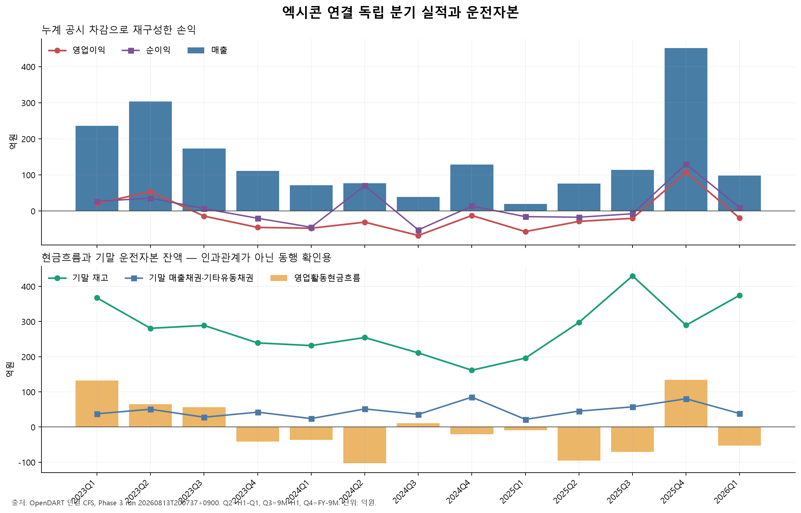
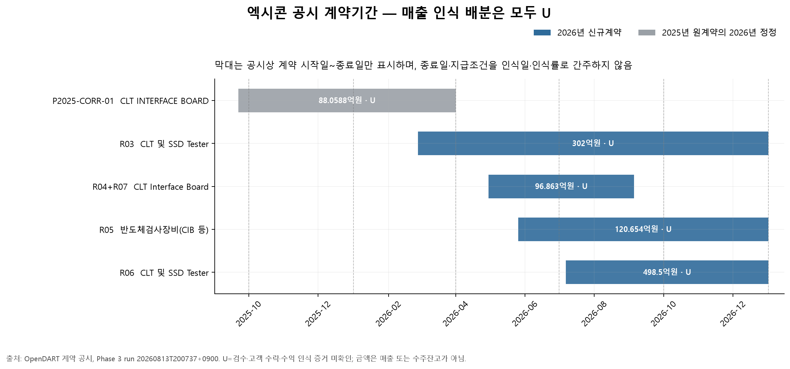

# 엑시콘 기업분석 Phase 3 — Historical과 계약 증거 연결

- 회사: 엑시콘(092870)
- DART corp_code: `00611736`
- 기준 컷오프: 2026-08-13 16:00 KST
- 최신성 재조회: 2026-08-13 20:04:15 KST
- 재무 기준: 연결 `CFS` 주계열, 별도 `OFS` 미혼합
- 금액 단위: 표에서 별도 표시가 없으면 억원

## 1. 단계 결론

Phase 3의 Historical 재구성과 계약 증거 연결을 완료했다.

1. OpenDART 최신성 게이트를 다시 조회한 결과 2026년 공시는 기존과 같은 19건이었다. 반기보고서 0건, 기준 원자료 이후 신규 관련 공시 0건, 해지·취소 0건이다.
2. 연결 CFS 누계 손익·현금흐름을 `Q2=H1-Q1`, `Q3=9M-H1`, `Q4=FY-9M`으로 차감해 2023Q1~2026Q1 독립 분기 13개를 만들었다.
3. 2023~2025년 매출·영업이익·순이익·OCF의 독립 분기 합계는 각 연간 공시액과 원 단위로 일치했다.
4. 2025Q4에서 2026Q1로 매출은 451.324억원에서 98.055억원으로 줄고, 기말 재고는 289.471억원에서 374.605억원으로 늘었으며, OCF는 134.647억원에서 -52.379억원으로 전환했다. 다만 이 동행만으로 계약별 생산·검수·매출 인식의 인과관계를 확정하지 않는다.
5. 계약기간이 겹치는 금액은 일정 맥락으로만 표시했다. 검수·고객 수락·수익 인식 증거가 없으므로 5개 고유계약의 계약별 인식액과 분기 배분은 모두 `U`다.

## 2. 최신 공시 게이트

조회 조건은 다음과 같다.

| 항목 | 값 |
|---|---|
| 1차 수집원 | OpenDART `GET /api/list.json` |
| 회사 | `corp_code=00611736` |
| 기간 | `bgn_de=20260101`, `end_de=20260813` |
| 정정 포함 | `last_reprt_at=N` |
| 정렬 | `sort=date`, `sort_mth=asc` |
| 페이지 | `page_no=1`, `page_count=100`; 실제 1페이지 |
| 조회시각 | 2026-08-13 20:04:15 KST |
| API 상태 | `000` |
| 결과 | 19건 |

Phase 2 기준 파일의 19개 접수번호와 재조회 결과를 집합 비교했다. 새 접수번호는 0개였다. 보고서명 정규식으로 정기보고서·단일판매/공급계약·정정·해지/취소를 별도 분류했으며, 반기보고서 0건과 해지·취소 0건을 재확인했다. 같은 날짜의 16:00 이후 공시 가능성을 배제하지 않고 재조회 시각을 별도로 남겼지만, 이번 재조회에서는 새 공시가 없었다.

- 게이트 요약: `raw/dart/phase3/gates/20260813T200415+0900/gate_summary.json`
- 원응답: `raw/dart/phase3/gates/20260813T200415+0900/disclosures_20260101_20260813.json`
- 원응답 SHA-256: `f508e0fd540fc5b0a511ff61f389b37de8e6d492ec20a675a07b179ca722ef9c`

## 3. 독립 분기 재구성

### 3.1 계산 규칙

| 대상 | Q1 | Q2 | Q3 | Q4 |
|---|---|---|---|---|
| 손익·OCF | Q1 누계 | H1 누계 - Q1 누계 | 9M 누계 - H1 누계 | FY - 9M 누계 |
| BS | 1분기 말 잔액 | 반기 말 잔액 | 3분기 말 잔액 | 사업연도 말 잔액 |

누락값은 0으로 바꾸지 않는다. 손익계산서·현금흐름표의 차감 결과와 재무상태표의 기말 잔액을 같은 독립 분기 행에 두되, 잔액과 기간 흐름의 의미를 구분한다.

### 3.2 연결 독립 분기 시계열

| 분기 | 매출 | 영업이익 | 순이익 | OCF | 기말 재고 | 기말 매출채권·기타유동채권 | 기말 현금 |
|---|---:|---:|---:|---:|---:|---:|---:|
| 2023Q1 | 235.713 | 20.334 | 26.748 | 131.959 | 367.235 | 37.709 | 102.736 |
| 2023Q2 | 303.555 | 54.026 | 35.669 | 64.998 | 280.785 | 50.611 | 302.600 |
| 2023Q3 | 172.681 | -14.216 | 6.603 | 56.138 | 288.834 | 27.935 | 348.785 |
| 2023Q4 | 111.014 | -45.497 | -20.159 | -41.171 | 239.216 | 42.380 | 295.597 |
| 2024Q1 | 71.454 | -47.721 | -44.846 | -36.900 | 231.640 | 24.127 | 245.609 |
| 2024Q2 | 77.288 | -30.910 | 69.999 | -102.851 | 254.501 | 51.502 | 58.324 |
| 2024Q3 | 38.886 | -67.817 | -52.362 | 11.305 | 210.785 | 35.985 | 153.870 |
| 2024Q4 | 128.486 | -12.526 | 13.621 | -20.352 | 161.571 | 85.010 | 86.660 |
| 2025Q1 | 19.155 | -57.067 | -15.606 | -8.657 | 196.141 | 21.792 | 293.305 |
| 2025Q2 | 75.674 | -28.801 | -17.237 | -95.601 | 297.417 | 45.339 | 281.434 |
| 2025Q3 | 114.114 | -20.330 | -7.604 | -70.737 | 429.829 | 57.325 | 248.235 |
| 2025Q4 | 451.324 | 107.000 | 130.083 | 134.647 | 289.471 | 80.466 | 458.233 |
| 2026Q1 | 98.055 | -19.659 | 9.348 | -52.379 | 374.605 | 38.403 | 333.848 |

2024Q2의 순이익 69.999억원은 누계 순이익에서 Q1을 차감한 공시 기반 결과다. 영업손실과 방향이 다른 이유를 임의로 영업외손익 항목에 배분하지 않았으며, 세부 손익 분해는 후속 본문 분석에서 원계정으로 확인한다.

## 4. 연간 합계 검산

| 연도 | 매출: 독립 분기 합계=FY | 영업이익 | 순이익 | OCF | 원 단위 차이 |
|---|---:|---:|---:|---:|---:|
| 2023 | 822.963 | 14.647 | 48.861 | 211.923 | 0 |
| 2024 | 316.113 | -158.973 | -13.588 | -148.797 | 0 |
| 2025 | 660.267 | 0.801 | 89.636 | -40.347 | 0 |

각 연도·계정에 대해 `Q1+Q2=H1`, `Q1+Q2+Q3=9M`, `Q1+Q2+Q3+Q4=FY`를 검사했다. 3개 연도 × 4개 계정 × 3개 롤업 = 36개가 모두 원 단위 차이 0으로 통과했다.

## 5. 재고·채권·OCF와 계약 일정 연결

### 5.1 관측된 재무 흐름

| 구간 | 매출 | OCF | 기말 재고 | 기말 채권 | 해석 범위 |
|---|---:|---:|---:|---:|---|
| 2025Q3 | 114.114 | -70.737 | 429.829 | 57.325 | 재고가 2025Q1 196.141억원에서 Q3 429.829억원으로 증가 |
| 2025Q4 | 451.324 | 134.647 | 289.471 | 80.466 | 매출·OCF 증가와 재고 감소가 동행; 채권은 증가 |
| 2026Q1 | 98.055 | -52.379 | 374.605 | 38.403 | 전분기 대비 매출·OCF 감소, 재고 증가, 채권 감소 |

2025Q4 대비 2026Q1 변화는 매출 -353.269억원(-78.3%), OCF -187.026억원, 재고 +85.134억원(+29.4%), 채권 -42.063억원(-52.3%), 현금 -124.385억원(-27.1%)이다. 이는 생산·출하·회수 주기의 변동 가능성을 보여 주지만, 계약별 원가 투입·납품·검수·고객 수락 자료가 없으므로 특정 계약의 진행률이나 인식액을 역산하지 않는다.

### 5.2 계약기간 중첩표

아래 금액은 해당 분기에 계약기간이 하루라도 겹치는 고유 계약액의 합이다. 동일 계약이 여러 분기에 반복되므로 분기 간 금액을 합산하면 안 된다. 매출·수주잔고·분기 인식액이 아니다.

| 분기 | 기간 중첩 계약 수 | 전체 공시 계약액 맥락 | 2026 신규계약액 맥락 | 분기 매출 배분 |
|---|---:|---:|---:|---|
| 2026Q1 | 2 | 390.0588 | 302.000 | `U` |
| 2026Q2 | 3 | 519.517 | 519.517 | `U` |
| 2026Q3 | 4 | 1,018.017 | 1,018.017 | `U` |
| 2026Q4 | 3 | 921.154 | 921.154 | `U` |

## 6. 계약별 인식증거 원장

| 출처 | 계약액 | 계약기간 | 지급조건 | 검수·수락 증거 | 확인된 인식액 | 인식 상태 |
|---|---:|---|---|---|---:|---|
| `P2025-CORR-01` | 88.0588 | 2025-09-22~2026-03-31 | 공시상 `-` | 미확인 | `U` | `U` |
| `R03` | 302.000 | 2026-02-27~2026-12-31 | 납품 후 90%, SET UP 후 10% | 미확인 | `U` | `U` |
| `R04`+`R07` | 96.863 | 2026-04-30~2026-09-04 | 제품 공급 후 100% | 미확인 | `U` | `U` |
| `R05` | 120.654 | 2026-05-26~2026-12-31 | 제품 공급 후 100% | 미확인 | `U` | `U` |
| `R06` | 498.500 | 2026-07-07~2026-12-31 | 납품 후 90%, SET UP 후 10% | 미확인 | `U` | `U` |

- 알려진 5개 계약액 합계: 1,106.0758억원
- 2026년 신규 4개 계약액 합계: 1,018.017억원
- 검수·고객 수락 증거가 연결된 계약액: 0억원
- 공시만으로 확인된 계약별 매출 인식액: `U`
- 인식 시점이 배분되지 않은 계약액: 1,106.0758억원

`검수 증거가 연결된 금액 0억원`은 실제 검수가 없었다는 뜻이 아니다. 현재 수집한 공식 자료에서 계약별 검수·수락 증거를 연결하지 못했다는 데이터 가용성 표시다. 따라서 `확인된 인식액`은 0이 아니라 `U`다.

## 7. 자동 검사와 데이터 계보

| 검사 범주 | 개수 | 통과 | 실패 |
|---|---:|---:|---:|
| 최신 공시 게이트 | 3 | 3 | 0 |
| 독립 분기 중간·연간 롤업 | 36 | 36 | 0 |
| 계약 고유건·신규합계·취소·U 상태 | 4 | 4 | 0 |
| 합계 | 43 | 43 | 0 |

Phase 3 실행 디렉터리는 `raw/dart/normalized/phase3/runs/20260813T200737+0900/`이며, 입력 3개와 출력 3개의 SHA-256을 `phase3_run_manifest.json`에 기록했다. API 키는 원응답·요약·매니페스트·코드·로그에 기록하지 않았다.

주요 출력은 다음과 같다.

- `historical_independent_quarters_cfs.json`: 독립 분기 13개, 원 단위 계산식·원천 접수번호·분기 증감 포함
- `contract_timing_evidence.json`: 계약별 `U`, 분기 중첩 일정, 인식 증거 규칙 포함
- `phase3_checks.json`: 43개 검사 실제값·기대값·차이·상태
- `phase3_run_manifest.json`: 입력·출력 경로와 SHA-256

## 8. 출처

재무는 OpenDART 연결 단일회사 전체 재무제표 API와 다음 정기공시 원문을 사용했다.

- [2023년 1분기보고서](https://dart.fss.or.kr/dsaf001/main.do?rcpNo=20230515001759), [반기보고서](https://dart.fss.or.kr/dsaf001/main.do?rcpNo=20230814000534), [3분기보고서](https://dart.fss.or.kr/dsaf001/main.do?rcpNo=20231114000324), [사업보고서](https://dart.fss.or.kr/dsaf001/main.do?rcpNo=20240318000915)
- [2024년 1분기보고서](https://dart.fss.or.kr/dsaf001/main.do?rcpNo=20240514001121), [반기보고서](https://dart.fss.or.kr/dsaf001/main.do?rcpNo=20240814002167), [3분기보고서](https://dart.fss.or.kr/dsaf001/main.do?rcpNo=20241114001677), [사업보고서](https://dart.fss.or.kr/dsaf001/main.do?rcpNo=20250317000963)
- [2025년 1분기보고서](https://dart.fss.or.kr/dsaf001/main.do?rcpNo=20250514000989), [반기보고서](https://dart.fss.or.kr/dsaf001/main.do?rcpNo=20250814002574), [3분기보고서](https://dart.fss.or.kr/dsaf001/main.do?rcpNo=20251114001559), [사업보고서](https://dart.fss.or.kr/dsaf001/main.do?rcpNo=20260316001681)
- [2026년 1분기보고서](https://dart.fss.or.kr/dsaf001/main.do?rcpNo=20260515001551)
- 계약 공시는 Phase 2의 `R03`~`R07` 및 `P2025-CORR-01` 원문을 사용했다.

## 9. 한계와 다음 게이트

1. 2026년 반기보고서가 제출되면 `2026Q2=2026H1-2026Q1`을 추가하고, 재고·채권·OCF와 계약 일정 연결을 다시 계산해야 한다.
2. 계약 종료일·지급조건만으로 매출 인식일·인식률을 만들지 않는다. 향후 검수·고객 수락·수익 인식 주석 또는 회사의 공식 확인 자료가 확보된 계약만 `U`에서 확인액으로 전환한다.
3. 제품별 매출 구조는 현재 OpenDART 핵심계정 API만으로 충분히 분해되지 않는다. 사업보고서·분기보고서 주석의 제품/지역/고객별 정보가 동일 기준으로 연결되는 범위만 후속 보고서에 반영한다.
4. `01_엑시콘_소스로그.xlsx`는 `Spreadsheets` 지침상 `@oai/artifact-tool` 전용 런타임으로만 작성해야 한다. 현재 세션에는 필수 `load_workspace_dependencies`가 제공되지 않아 대체 라이브러리를 쓰지 않고 보류했다.

