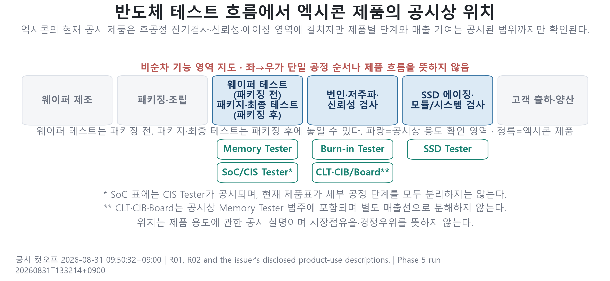
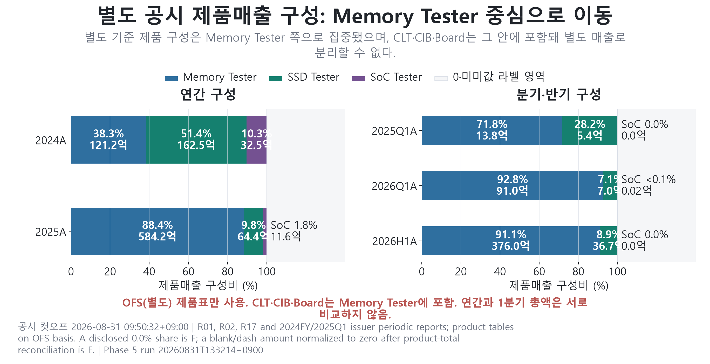
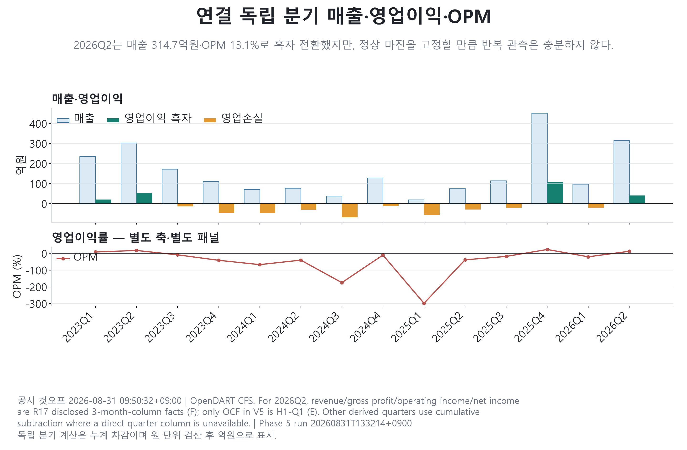
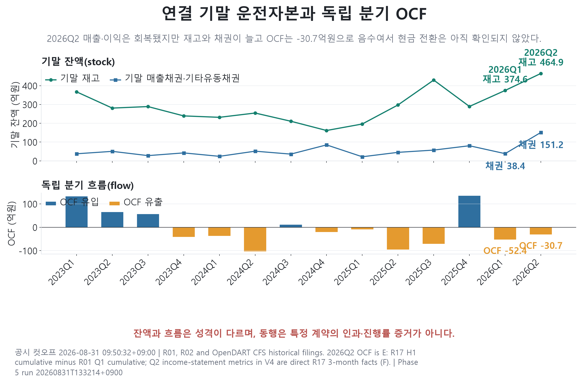
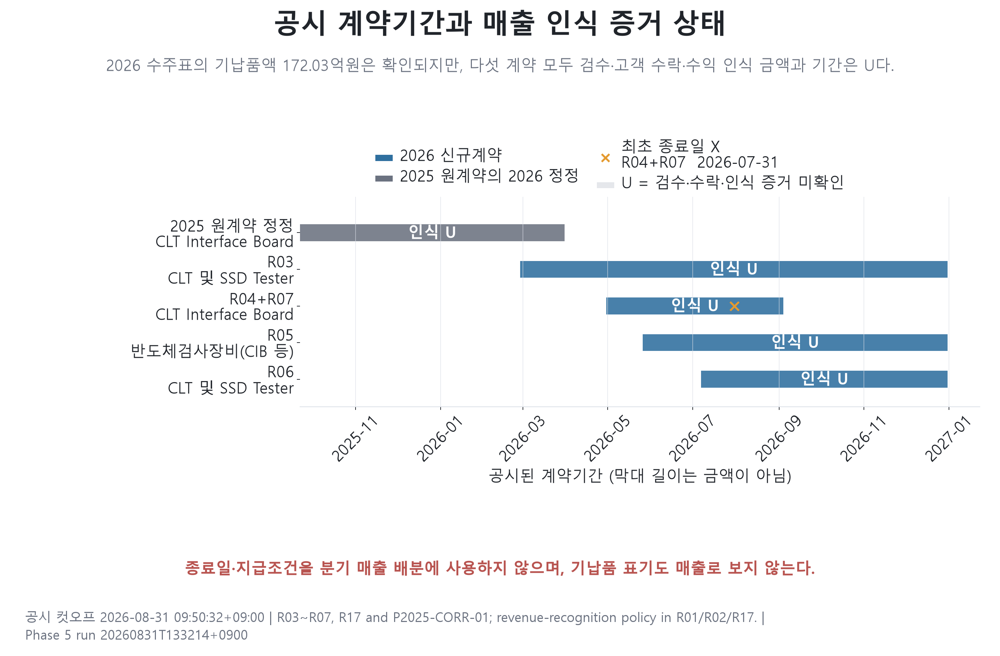
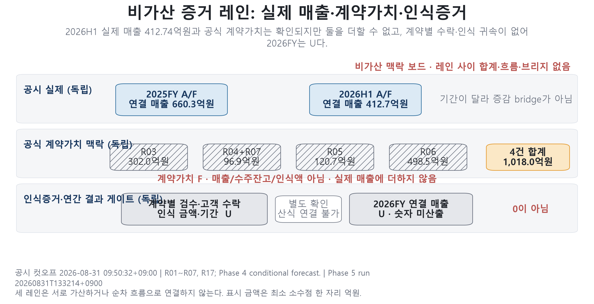
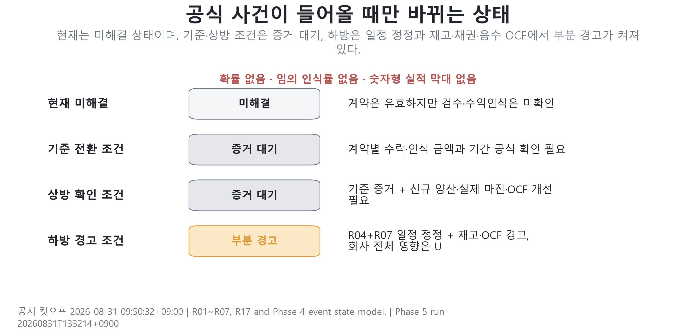
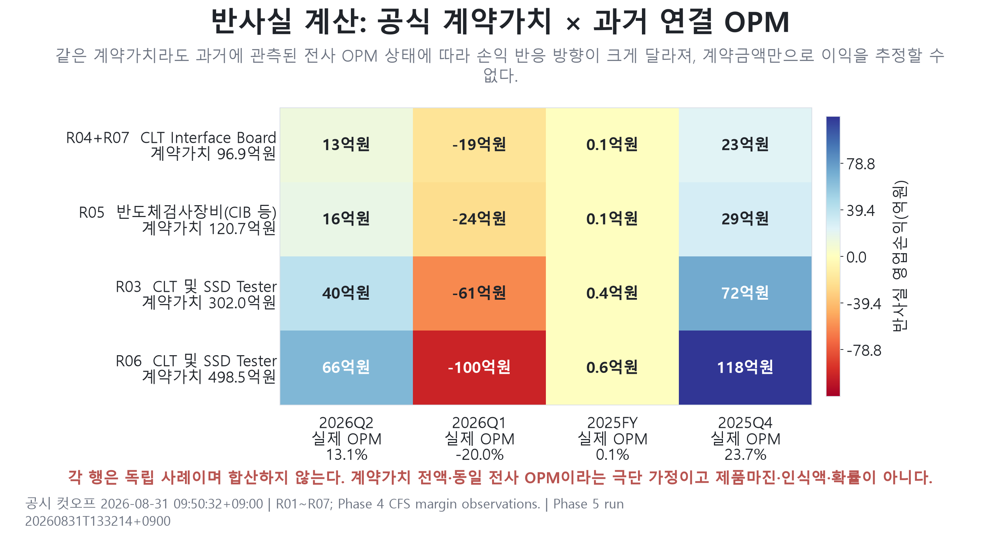
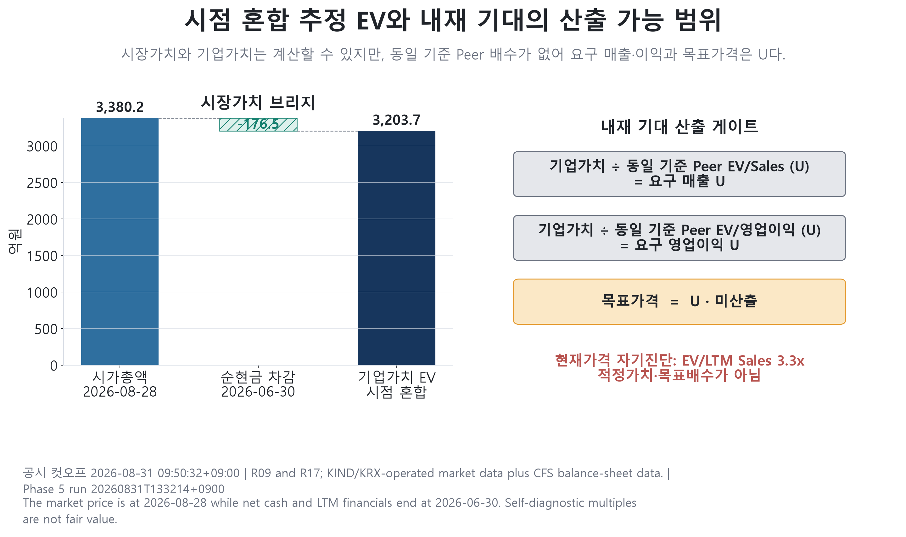
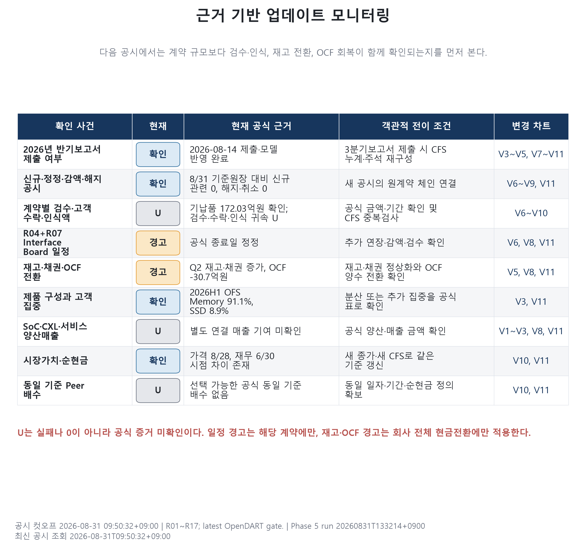

# 엑시콘 기업분석 보고서

> 분석 기준일: 공시 2026-08-31 09:50 KST / 시장가격 2026-08-28 종가 / 재무 2026-06-30  
> 범위: 서술형 기업분석. 적정가치·목표주가·투자의견은 제시하지 않는다.  
> 핵심 질문: 반도체 테스트 산업의 구조적 순풍 속에서 엑시콘은 어디에 위치하며, 2026년 대형 수주가 매출·이익·현금흐름으로 얼마나 전환됐는가?

## Executive Summary

엑시콘의 2026년 상반기는 **매출과 영업이익의 전환은 확인됐지만 현금 전환은 아직 끝나지 않은 상태**다. 연결 기준 상반기 매출은 412.74억원, 영업이익은 21.69억원, 영업현금흐름은 -83.11억원이다. 2분기만 보면 매출 314.69억원, 영업이익 41.35억원, 영업이익률 13.14%로 회복했으나, 파생 계산한 2분기 영업현금흐름은 -30.73억원이다.

산업 배경은 우호적이다. SEMI는 2026년 글로벌 테스트 장비 매출이 31.0% 증가한 153억달러에 이를 것으로 전망했고, AI·HBM·이종 패키징의 복잡성과 성능·신뢰성 요구를 동인으로 제시했다. 그러나 이는 글로벌 산업 맥락 `C`이지 엑시콘 매출 성장률이 아니다. 엑시콘의 확인된 위치는 후공정의 Memory·Burn-in·CLT, SSD Aging Tester와 관련 보드, CIS 중심 SoC Tester이며 2026년 상반기 제품매출은 Memory 91.1%, SSD 8.9%, SoC 비중 0.0%였다. 전용 HBM Tester나 HBM 직접 매출은 공개자료에서 확인되지 않는다.

반기보고서의 수주표에는 공식 계약가치 1,018.01억원, 기납품 172.03억원, 잔고 845.98억원이 제시된다. 그러나 이 표는 재무상태표일 뒤인 2026-07-07 계약 498.50억원까지 포함하므로 845.98억원을 6월 30일 수주잔고로 읽을 수 없다. 또한 기납품·판매공급·현금수령은 확인됐지만 계약별 검수·고객 수락·연결매출 귀속액은 공개되지 않았다. 따라서 계약가치와 기납품은 `F`, 계약별 수익인식액은 `U`다. 회사 전체 상반기 매출과 계약별 기납품을 더하면 중복 계산 위험이 생긴다.

2026-08-28 종가 25,900원과 상장주식 수 13,050,797주로 계산한 시가총액은 3,380.16억원이다. 2026-06-30 순현금 176.49억원을 차감한 시점 혼합 추정 EV는 3,203.66억원이다. LTM 매출 978.18억원과 영업이익 108.36억원에 대한 자기진단 배수는 각각 3.28배와 29.57배다. 이는 적정가치가 아니다. 같은 기준의 비교기업 배수와 계약별 인식액이 없으므로 요구 매출·요구 이익·목표가격은 모두 `U`로 남긴다.

### 핵심 질문에 대한 답

| 질문 | 현재 답 | 상태 | 판단 근거 |
|---|---:|:---:|---|
| 2026년 계약이 매출로 얼마나 인식됐는가 | 계약별 인식액 식별 불가 | `U` | 기납품 172.03억원은 확인되나 검수·수락·연결매출 귀속 문구 없음 |
| 이익과 현금흐름으로 전환됐는가 | H1 EBIT 21.69억원, OCF -83.11억원 | `F/E` | 2분기 흑자 전환에도 재고·채권 증가로 현금 전환 미완료 |
| 현재 시장가치는 무엇을 반영하는가 | EV 3,203.66억원, EV/LTM Sales 3.28배 | `E` | 가격일과 재무일이 다른 자기진단 값; 적정가치 아님 |
| 숫자형 Base·목표주가를 낼 수 있는가 | 산출 불가 | `U` | 계약별 인식, 제품별 마진, 동일 기준 Peer 배수 미확보 |
| 다음 반증·업데이트 조건은 무엇인가 | 검수·수락, Q3 현금전환, 계약 정정·해지, 고객·제품 분산 | `M` | 공식 공시가 발생할 때만 상태와 수치 갱신 |

## 1. 분석 방법과 업종 범위

이 보고서는 `F/C/E/M/U` 상태를 사용한다.

- `F`(Fact): 정기공시·계약공시·공식 시장자료로 확인한 사실
- `C`(Context): 산업·회사 설명 등 방향성을 이해하는 맥락
- `E`(Estimate): 공시 수치의 차감·비율·기계 계산
- `M`(Monitoring): 다음 공시에서 확인할 사건과 전이 조건
- `U`(Unverified/Unavailable): 공개 증거로 식별할 수 없는 값

완료의 의미는 모든 칸에 숫자를 채우는 것이 아니라, **확인 가능한 값은 수치로, 확인 불가능한 값은 근거 있는 `U` 판정으로 닫는 것**이다. `U`를 0으로 바꾸거나 임의의 인식률·제품마진·Peer 배수를 넣지 않았다.

| 업종 범주 | 주된 기능 | 엑시콘과의 구분 |
|---|---|---|
| ATE | 전기 신호로 소자의 기능·성능·신뢰성 판정 | 엑시콘의 핵심 사업 범주 |
| 인터페이스·이송·열제어 | 보드·소켓·프로브카드·핸들러·챔버 | 엑시콘은 일부 Board·Chamber형 장비를 공급하지만 전체 생태계를 포괄하지 않음 |
| 검사·계측 | 광학·전자빔 등으로 물리적 결함과 치수 측정 | 전기적 기능 테스트와 다른 장비군 |
| OSAT | 패키징과 테스트를 위탁 수행하는 제조 서비스 | 엑시콘은 서비스 사업자가 아니라 장비 공급사 |

## 2. 산업구조·동향과 엑시콘의 포지션

### 2.1 산업구조: 테스트는 한 번의 공정이 아니다

반도체 테스트는 설계 검증, 웨이퍼 테스트, 패키지 최종 테스트, Burn-in, System Level Test, SSD Aging 등 여러 삽입점에서 품질·수율·출시속도·테스트 원가를 관리한다. 수요 주체도 IDM 한 종류가 아니라 팹리스, 파운드리, OSAT로 나뉜다. 웨이퍼 단계에서는 ATE·프로버·프로브카드가, 패키지 단계에서는 ATE·핸들러·소켓·인터페이스 보드·열제어가 결합된 **테스트 셀**이 필요하다. [Advantest 2026 Investors Guide](https://www.advantest.com/document/en/investors/ir-library/investors-guide/Investors_Guide_2601E.pdf)는 양산 테스트를 웨이퍼 테스트와 패키지 테스트로 구분하고, 복잡성이 커질수록 Tester뿐 아니라 Handler·Device Interface·열제어를 함께 최적화해야 한다고 설명한다.

장비 수요는 반도체 출하량만으로 결정되지 않는다. 개념적으로는 `소자 수 × 테스트 삽입 수 × 테스트 시간 ÷ 병렬도`에서 기존 장비의 재사용·업그레이드와 수율 안정화 효과를 차감한 결과가 신규 테스터·보드·서비스 수요가 된다. 복잡도·고속 I/O·전력밀도·칩렛·3D 적층·고가 패키지는 테스트 강도를 높이지만, 병렬 테스트·Adaptive Test·기존 플랫폼 재사용·투자 지연은 신규 장비 수요를 낮출 수 있다.

### 2.2 2026년 동향: AI/HPC가 테스트 강도를 높이지만 수혜는 자동이 아니다

| 공식 근거 | 확인된 산업 변화 | 엑시콘에 대한 해석 | 상태·남은 증거 |
|---|---|---|---|
| SEMI 2026-07-14 | 테스트 장비: 2025년 +55.3%, 2026년 +31.0%·153억달러 전망 | 글로벌 기회 집합 확대 | 산업 `C`, 엑시콘 점유율 `U` |
| SEMI 2026-04-01 | AI Training은 HBM, Inference는 데이터센터 NAND·Storage 수요를 강화 | Memory·SSD Tester의 방향성과 부합 | 고객 투자·발주 전환 `M/U` |
| Advantest IAR 2025 | Chiplet·2.5D/3D·HBM 결합이 열·신호·신뢰성 문제와 다중 Test Insertion을 확대 | 테스트 난도 상승은 우호적 | 엑시콘 HBM 직접 매출 `U` |
| Teradyne 2025 10-K | AI Compute가 2025년 Semiconductor Test 성장을 견인, HBM·DRAM Final Test는 중요 영역 | 업계 테스트 수요의 실제 사례 | 타사 실적을 엑시콘 성장률로 대입 금지 |

SEMI는 2026년 DRAM 장비 투자가 39.0%, NAND 장비 투자가 30.7% 증가할 것으로 전망했다. 한국 설비투자의 주요 동인으로 HBM 등 첨단 메모리를 지목했다. 동시에 글로벌 장비사의 사례는 테스트 플랫폼 시장이 소수 대형 고객에 집중될 수 있음을 보여준다. 따라서 업황 강세는 엑시콘의 **기회 집합**을 넓히지만 고객 승인·발주·검수·회수가 확인되기 전 회사 수혜를 확정하지 않는다.

### 2.3 엑시콘의 포지션

엑시콘은 반도체 제조 전 공정을 포괄하는 회사가 아니라, 공시상 Memory Tester, SSD Tester, SoC Tester와 관련 보드·인터페이스 제품을 공급하는 후공정 테스트 장비 업체다. AI·HPC, 고용량 메모리, SSD 수요가 테스트 강도를 높일 수 있다는 산업 맥락은 `C`다. 이 맥락을 엑시콘의 점유율이나 계약금액으로 직접 치환할 수는 없다.

공정 맵에서도 웨이퍼 테스트와 패키지 최종 테스트를 구분해야 한다. 회사 제품 용도는 여러 테스트 지점에 걸칠 수 있어 단순한 좌→우 단일 순서로 표현하지 않았다. 제품별 실제 매출 기여는 정기공시의 제품 표로만 확인한다.

**그림 결론:** 엑시콘의 공식 제품군은 테스트 기능 영역에 위치하지만, 공시만으로 각 장비의 공정별 점유율이나 고객 투자 전환율은 알 수 없다.

| 제품군 | 공시상 기능 영역 | 2026 H1 매출 증거 | 산업 노출 | 아직 모르는 것 |
|---|---|---:|---|---|
| Memory·CLT·Burn-in·CIB | DRAM Component·Module·신뢰성 테스트 | 91.1% `F` | 첨단 Memory 투자 `C` | 세부 제품별 매출·점유율·HBM 직접 매출 `U` |
| SSD Tester | SATA·SAS·PCIe Gen5·UFS Aging Test | 8.9% `F` | Enterprise SSD·NAND `C` | 고객·규격별 매출과 마진 `U` |
| SoC·CIS | Wafer/Package 기능검사 플랫폼 | 비중 0.0% `F`, 금액 0 `E` | AI ASIC·CIS 확장 가능성 `C` | 양산매출·시장점유율 `U` |
| Board·Interface | Memory 범주에 포함된 CIB·Memory Board | 별도 매출 미공개 | 설치기반 후속 수요 가능성 `C` | 반복매출·교체주기 `U/M` |

엑시콘은 AI 테스트 생태계 전체를 공급하는 글로벌 Full-line ATE 기업도, 반복 교체형 Probe Card·Socket 순수업체도 아니다. 현재 확인되는 실적 노출은 단일 고객 중심의 Memory·SSD Tester와 관련 Board다. 회사는 PCIe Gen6 SSD Tester, CXL, SoC·CIS를 개발 방향으로 제시하지만, 로드맵은 매출이 아니다. 특히 HBM은 산업 테스트 강도를 높이는 핵심 배경이지만 엑시콘의 전용 HBM 장비·직접 매출 증거는 없다.

### 2.4 이 분석이 갖는 의미

**그림 결론:** 산업 수요와 엑시콘 매출 사이에는 고객 투자, 발주, 납품, 검수·수락이라는 별도의 증거 관문이 있다.

산업 호황은 엑시콘의 기회를 넓히지만 수혜를 확정하지 않는다. 이 분석의 의미는 AI·메모리 업황을 낙관적으로 설명하는 데 있지 않고, `산업 수요 → 고객 투자 → 장비 승인·수주 → 납품·검수 → 매출 인식 → 현금 회수`가 실제로 이어지는지를 공식 증거로 단계별 검증하는 데 있다.

- **산업:** 테스트 장비 성장과 Memory·Storage 투자 확대는 기회 집합을 뒷받침하는 `C`
- **회사:** 대형 수주, 2026 H1 매출 회복과 Q2 영업흑자는 관측된 `F/E`
- **실행:** 계약별 검수·고객수락·매출 귀속은 `U`, 재고·채권·OCF 정상화는 `M`
- **해석:** 산업 강세는 증거 공백을 없애기보다 엑시콘의 실행·현금 전환에 대한 기대와 검증 기준을 높임

## 3. 회사와 제품 구조

2026년 상반기 별도(OFS) 제품 매출은 Memory Tester 376.00억원(91.1%), SSD Tester 36.74억원(8.9%), SoC Tester 0에 가까운 수준이다. SoC 비중 0.0%는 공시 사실 `F`, 원문 공란과 제품합계 대사로 산출한 금액 0원은 `E`다. Memory 범주에는 Burn-in, CLT, CIB Board 등이 포함돼 있으므로 이를 임의로 세분화하지 않았다. 같은 기간 연결(CFS) 총매출이 별도 총매출 412.74억원과 원 단위로 일치하고 일본 종속법인 수익이 0이지만, 제품 믹스 자체는 **OFS 공시**이며 CFS 제품분해라고 부르지 않는다.

주요 고객 1의 상반기 매출은 395.96억원으로 연결 총매출의 95.93%다. 공개된 2026년 4개 계약의 상대방도 모두 삼성전자다. 매출 회복의 강도와 고객 집중 위험이 동시에 커진 셈이다.

**그림 결론:** 상반기 매출 회복은 Memory 계열에 집중돼 있으며 SoC·서비스의 별도 양산 매출 증거는 아직 없다.

## 4. Historical 실적과 재무 품질

### 4.1 손익 전환

| 구분 | 매출 | 매출총이익 | 영업이익 | 순이익 | OCF | OPM |
|---|---:|---:|---:|---:|---:|---:|
| 2025 H1 | 94.83 | 12.94 | -85.87 | -32.84 | -104.26 | -90.55% |
| 2026 Q1 | 98.06 | 34.06 | -19.66 | 9.35 | -52.38 | -20.05% |
| 2026 Q2 | 314.69 | 111.55 | 41.35 | 75.87 | -30.73 `E` | 13.14% |
| 2026 H1 | 412.74 | 145.61 | 21.69 | 85.21 | -83.11 | 5.26% |

단위: 억원, 연결 기준. 2분기 매출·매출총이익·영업이익·순이익은 R17 3개월 열 직접 공시 `F`이고, 2분기 OCF만 H1 누계에서 Q1을 차감한 `E`다.

상반기 매출은 전년 동기 대비 335.25% 증가했고, 2분기 매출이 상반기의 76.24%를 차지한다. 2025년 4분기와 2026년 2분기의 높은 매출·마진은 장비 인도 시점에 따른 분기 변동성을 보여준다. 반대로 2026년 1분기 OPM -20.05%도 관측 범위에서 제거하면 안 된다. 2분기 OPM 13.14%는 최신 실제 앵커이지 정상 마진 가정이 아니다.

상반기 순이익 85.21억원에는 지분법이익 37.97억원, 관계기업처분익 9.28억원, 법인세수익 7.96억원이 포함된다. 따라서 순이익률 20.65%를 정상 영업수익성으로 사용하지 않았다.

**그림 결론:** 2분기에는 영업레버리지로 흑자 전환했지만 과거 분기 편차가 커 단일 분기 마진을 장기화할 수 없다.

### 4.2 운전자본과 현금 전환

재고는 2025년 말 289.47억원에서 2026년 1분기 374.61억원, 6월 말 464.94억원으로 증가했다. 6월 말 유동 채권은 151.18억원으로 1분기 38.40억원보다 112.78억원 늘었다. 상반기 영업운전자본 변동 중 채권 효과는 -76.94억원, 재고 효과는 -178.15억원이었다. 매입채무 증가 +148.04억원이 일부 상쇄했지만 OCF는 -83.11억원에 머물렀다.

현금및현금성자산 358.99억원과 단기금융상품 50억원에서 차입금 232.50억원을 차감한 계산상 순현금은 176.49억원이다. 유동성 위기로 단정할 근거는 없으나, 제작·납품·대금회수 사이의 운전자본 부담은 실제다.

**그림 결론:** 매출과 영업이익이 회복된 2분기에도 재고·채권 증가와 음의 OCF가 함께 나타나 현금 전환 검증이 남아 있다.

## 5. 수주 원장과 매출 인식

### 5.1 공시 계약과 반기보고서 진행표

| ID | 계약 | 계약가치 | 기납품 | 공시 잔고 | 종료일 | 인식 상태 |
|---|---|---:|---:|---:|---|:---:|
| R03 | CLT·SSD Tester | 302.00 | 160.00 | 142.00 | 2026-12-31 | `U` |
| R04+R07 | CLT Interface Board | 96.86 | 12.03 | 84.83 | 2026-09-04 | `U` |
| R05 | CIB 등 | 120.65 | 0.00 | 120.65 | 2026-12-31 | `U` |
| R06 | CLT·SSD Tester | 498.50 | 0.00 | 498.50 | 2026-12-31 | `U` |
| 합계 | 공시 수주표 | 1,018.01 | 172.03 | 845.98 | — | 비가산 |

단위: 억원. R06은 2026-07-07 체결돼 6월 30일 뒤 사건이다. 6월 30일 이전 세 계약의 기계적 소계는 계약가치 519.51억원, 기납품 172.03억원, 잔고 347.48억원이지만 이는 회사가 별도 공시한 6월 말 수주잔고가 아니다.

반기보고서 진행표는 R03·R04에 대해 판매·공급과 현금수령 약 160억원·12억원을 보여준다. 그러나 원문에는 계약별 `검수`, `고객 수락`, `연결매출 인식액`이 없다. 회사 전체 수익인식 정책은 진행률을 적용하지 않고 인도기준으로 인식한다. 이 때문에 다음 세 레인은 합산하지 않는다.

1. 회사 전체 실제 매출: 2025 FY 660.27억원, 2026 H1 412.74억원 (`F`)
2. 공식 계약가치와 기납품: 1,018.01억원, 172.03억원 (`F`, 표 범위 주의)
3. 계약별 연결매출 귀속액: `U`

**그림 결론:** 종료일과 기납품 사실은 확인되지만 계약별 검수·수락·수익인식 시점은 여전히 공백이다.

**그림 결론:** 회사 전체 매출, 계약가치, 계약별 인식증거는 독립 레인이며 어떤 두 숫자도 더해 2026년 매출을 만들 수 없다.

## 6. 조건부 전망과 시나리오

2026년 상반기까지는 실제치로 닫았다. 하반기 숫자형 Base·Bull·Bear는 계약별 인식액과 제품별 마진이 공개되지 않아 만들지 않았다. 시나리오는 수치 예측이 아니라 **공식 증거가 들어올 때 상태가 바뀌는 사건 규칙**이다.

| 상태 | 진입 조건 | 모델 조치 |
|---|---|---|
| Base 증거 대기 | 기존 계약 유지 + 공식 검수·수락·인식액 확인 | 확인액만 H2 실제/추정 bridge에 연결 |
| Bull 증거 대기 | 추가 계약 또는 신규 제품 양산매출 + 현금전환 동반 | 공식 금액과 실제 마진만 추가; 기대 매출 선반영 금지 |
| Bear 부분 경고 | 종료일 연장·감액·해지, 미검수, 재고·채권 증가와 OCF 악화 | 영향 계약을 `U`/이연/제거하고 실제 OCF로 갱신 |

**그림 결론:** 현재는 Base와 Bull 모두 증거 대기이고, 일정과 현금전환에는 부분 경고가 켜져 있다.

아래 민감도는 계약가치 전액에 과거 연결 OPM을 곱한 반사실 계산이다. 인식률, 제품마진, 확률 또는 전망이 아니다. 같은 498.5억원 계약도 OPM -20.05%에서는 약 -100억원, OPM 23.71%에서는 약 +118억원의 기계적 결과가 된다. 계약금액만으로 이익을 추정하면 안 된다는 범위 검사다.

**그림 결론:** 수주 규모보다 실제 인식 시점과 회사 전체 마진 상태가 손익 방향을 좌우하므로 계약액 단독 전망은 무효다.

## 7. 시장가치와 내재 기대

| 항목 | 값 | 기준·상태 |
|---|---:|---|
| 종가 | 25,900원 | 2026-08-28 `F` |
| 상장주식 수 | 13,050,797주 | 시가총액 계산 `F` |
| 시가총액 | 3,380.16억원 | 가격×상장주식 수 `E` |
| 순현금 | 176.49억원 | 2026-06-30 `E` |
| 시점 혼합 추정 EV | 3,203.66억원 | 시가총액−순현금 `E` |
| LTM 매출 / 영업이익 | 978.18 / 108.36억원 | 2025Q3~2026Q2 `E` |
| EV/LTM Sales | 3.28배 | 자기진단, 적정가치 아님 |
| EV/LTM EBIT | 29.57배 | 자기진단, 적정가치 아님 |
| 요구 매출·요구 EBIT·목표가격 | 산출 불가 | 동일 기준 Peer 배수 `U` |

시가총액에는 총 상장주식 수를 사용했다. 가중평균·유통 기준 주식 수는 자기주식 100,000주를 제외한 12,950,797주다. 전환사채 등 잠재 희석증권은 현재 공시상 확인되지 않았고 기본 EPS와 희석 EPS가 같다.

가격일은 8월 28일, 순현금과 LTM 재무의 종료일은 6월 30일이므로 EV는 시점 혼합 추정치다. 현재 시장가치는 상반기 흑자 전환뿐 아니라 하반기 계약 실행과 현금회수를 추가로 기대하는 것으로 해석할 수 있지만, 그 기대를 한 개의 요구 매출 숫자로 역산할 객관적 배수는 없다.

**그림 결론:** EV는 계산할 수 있으나 동일 기준 비교배수가 없으므로 요구 실적과 목표가격은 `U`이며, 3.28배는 현재가격 자기진단일 뿐이다.

## 8. 리스크, 반증 조건, 모니터링

1. **고객 집중:** 주요 고객 1이 상반기 매출의 95.93%이고 공개 계약 4건의 상대방이 동일하다. 공식 신규고객·지역분산 증거가 없으면 장기 성장률을 확장하지 않는다.
2. **인식·납기 집중:** R04 종료일이 이미 한 차례 연장됐고 R03·R05·R06은 12월 31일에 집중된다. 종료일은 매출 인식일이 아니다.
3. **현금 전환:** 재고·채권이 증가한 상태에서 H1·Q2 OCF가 음수다. Q3 이후 재고 정상화, 채권 회수, OCF 양수 전환을 함께 본다.
4. **제품 집중:** OFS Memory 매출 비중이 91.1%다. SoC·CXL·서비스 양산매출은 공식 금액이 확인되기 전까지 `U`다.
5. **감사·수익인식 판단:** 2026년 감사인이 삼정회계법인으로 변경됐다. 현재 확보한 반기보고서 본문 XML에는 독립된 반기검토 결론이 없어 무수정 결론으로 단정하지 않는다. 전기 핵심감사사항은 제품매출 수익인식이었다.
6. **회계기준 변경:** 회사는 2027년 K-IFRS 1118 적용과 비교정보 재작성을 예고했다. 2026년과 2027년 영업손익 시계열 비교에는 정의 변경 bridge가 필요하다.

**그림 결론:** 다음 공시에서 계약 규모보다 검수·인식, 재고·채권 정상화, OCF 회복을 먼저 확인해야 한다.

## 9. 결론

2026년 상반기에는 대형 수주가 사업 전환의 가능성만 보여준 것이 아니라 실제 회사 전체 매출 412.74억원과 영업이익 21.69억원으로 연결되는 **관측된 회복**이 있었다. 다만 계약별로 어떤 금액이 그 매출에 귀속됐는지는 공개자료에서 식별되지 않는다. 기납품 172.03억원을 상반기 매출에 다시 더할 수 없고, 7월 계약을 포함한 845.98억원을 6월 말 잔고로 부를 수도 없다.

분석의 초점은 이제 “수주가 있는가”에서 “수주가 검수·수락·매출·현금으로 전환되는가”로 이동한다. 가장 강한 긍정 증거는 2분기 영업흑자다. 가장 강한 경고 증거는 재고·채권 증가와 음의 OCF다. 현재 가격에서 계산되는 EV 3,203.66억원은 이 전환이 더 이어질 것이라는 기대를 포함하지만, 동일 기준 Peer 배수가 없으므로 적정가치·목표가격 판단은 유보한다.

따라서 현재 결론은 **운영 회복 확인 / 현금 전환 미완료 / 계약별 수익인식 U / 목표가격 U**다. 다음 결론 변경은 추정이 아니라 후속 공시와 실제 현금흐름이 만든다.

## 부록 A. 출처 레지스트리

| ID | 등급 | 원문 | 사용 범위 |
|---|---|---|---|
| R01 | A/F | [2026년 1분기보고서](https://kind.krx.co.kr/external/2026/05/15/001739/20260515003852/11013.htm) | Q1 재무·제품·수익인식 |
| R02 | A/F | [2025년 사업보고서](https://kind.krx.co.kr/external/2026/03/16/002754/20260316007744/11011.htm) | 과거 재무·사업·감사 |
| R03 | A/F | [302억원 계약](https://dart.fss.or.kr/dsaf001/main.do?rcpNo=20260304901110) | 계약금액·기간·상대방 |
| R04 | A/F | [96.863억원 계약](https://dart.fss.or.kr/dsaf001/main.do?rcpNo=20260506900318) | 계약금액·최초 일정 |
| R05 | A/F | [120.654억원 계약](https://dart.fss.or.kr/dsaf001/main.do?rcpNo=20260604900245) | 계약금액·기간 |
| R06 | A/F | [498.5억원 계약](https://dart.fss.or.kr/dsaf001/main.do?rcpNo=20260710900182) | 계약금액·기간 |
| R07 | A/F | [Board 계약 정정](https://dart.fss.or.kr/dsaf001/main.do?rcpNo=20260727900650) | 종료일 연장 |
| R09 | A/F | [KIND 주가정보](https://kind.krx.co.kr/common/stockprices.do?isurCd=09287&method=searchStockPricesMain) | 2026-08-28 종가 |
| R10 | A/F | [DART 정기공시 검색](https://dart.fss.or.kr/navi/searchNavi.do?naviCode=A002&naviCrpCik=00611736&naviCrpNm=%EC%97%91%EC%8B%9C%EC%BD%98) | 최신성 게이트 |
| R17 | A/F | [2026년 반기보고서, 접수 20260814001521](https://dart.fss.or.kr/dsaf001/main.do?rcpNo=20260814001521) | H1/Q2 재무·제품·계약 진행·주식·감사 |
| R18 | A/C | [SEMI 2026 Mid-Year Equipment Forecast, 2026-07-14](https://www.semi.org/en/semi-press-release/global-semiconductor-equipment-sales-forecast-to-reach-a-record-229-billion-dollars-in-2028-semi-reports) | 테스트·DRAM·NAND 장비 전망과 AI/HBM 동인 |
| R19 | A/C | [SEMI 300mm Fab Outlook, 2026-04-01](https://www.semi.org/en/semi-press-release/semi-projects-double-digit-growth-in-global-300mm-fab-equipment-spending-for-2026-and-2027) | AI Training-HBM, Inference-Storage/NAND 연결 |
| R20 | A/C | [Advantest Investors Guide 2026](https://www.advantest.com/document/en/investors/ir-library/investors-guide/Investors_Guide_2601E.pdf) | 웨이퍼·패키지 테스트, Test Cell·고객 구조 |
| R21 | A/C | [Advantest Integrated Annual Report 2025](https://www.advantest.com/document/en/investors/ir-library/annual/E_all_IAR2025.pdf) | Chiplet·3D·HBM 복잡도와 다중 Test Insertion |
| R22 | A/C | [Teradyne 2025 Form 10-K, 2026-02-19](https://investors.teradyne.com/sec-filings/all-sec-filings/content/0001193125-26-059002/ter-20251231.htm) | AI·HBM/DRAM Test 수요와 고객집중 맥락 |

산업 전망과 글로벌 장비사 실적은 엑시콘의 숫자형 Base나 목표가격 입력에 사용하지 않았다. 산업 `C`, 엑시콘 직접 사실 `F`, 계산 `E`, 미확인 `U`를 분리했다.

## 부록 B. 재현성과 QA

- 최신 공시 게이트: `20260831T095032+0900`, 목록 20건, 신규 관련 0건, 반기보고서 1건
- OpenDART 정규화: 208/208 PASS
- Phase 3 Historical·계약: 47/47 PASS
- Phase 4 조건부 모델·시장가치: 138/138 PASS
- Phase 5 차트 데이터: 132/132 PASS
- Phase 5 렌더: 77/77 PASS
- 수동 시각 QA: 11/11 PASS, 미해결 시각 결함 0
- 최신 Phase 5 run: `20260831T133214+0900`
- 반기 원문 XML SHA-256: `035C607AE99C700743F24DA5A84246D27A7E7D9A75BD9DC8BABD383AF65F7505`

세부 한계와 전이 규칙은 `05_엑시콘_분석한계와_업데이트체크리스트.md`, 시각화 검증은 `05_엑시콘_Phase5_시각화_검증.md`, 전체 실행 이력은 `YIG_엑시콘_기업분석_작업로그.md`를 따른다.
