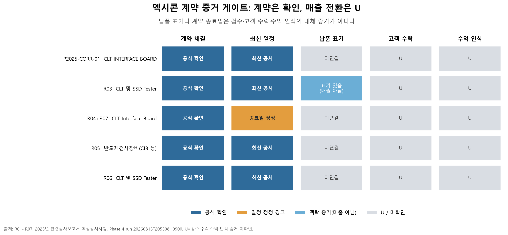
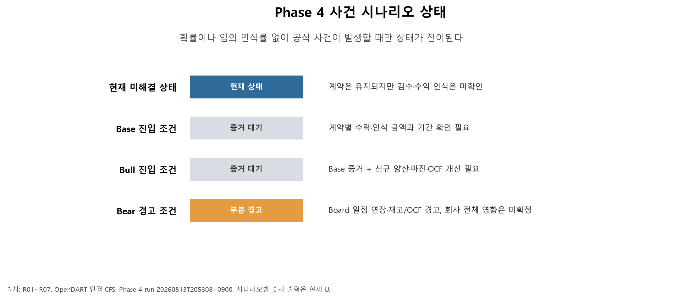
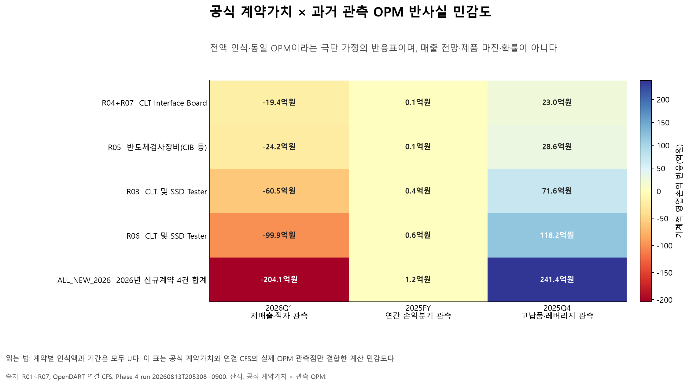

# 엑시콘 기업분석 Phase 4 — 조건부 전망, 사건 시나리오, 시장 내재 기대

- 회사: 엑시콘(092870)
- DART corp_code: `00611736`
- 공시 컷오프: 2026-08-13 16:00 KST
- 최신성 재조회: 2026-08-13 20:31:16 KST
- 재무 기준: 연결 `CFS` 주계열, 별도 `OFS`는 제품구조 보조 확인에만 사용
- Phase 4 모델 실행: `raw/dart/normalized/phase4/runs/20260813T205308+0900/`

## 1. 단계 결론

Phase 4의 조건부 전망·시나리오·시장가치 계층을 완료했다. 결론은 숫자형 Base Case가 아니라 **현재 증거로는 결과가 미해결이며, 공식 사건이 확인될 때만 전망값이 열리는 구조**다.

1. 최신 OpenDART 게이트에서 반기보고서, 신규 관련 공시, 해지·취소가 추가되지 않았다. 따라서 2026년 1분기 연결실적과 기존 계약 원장을 계속 기준 입력으로 사용했다.
2. 장비 매출은 설치·테스트·검수 완료와 고객 수락이 있어야 인식한다. 2025년 연결감사보고서에서 감사인도 조기 매출 인식과 기간귀속을 핵심감사사항으로 다뤘다. 수주표의 `기납품액`은 이 조건을 충족했다는 증거가 아니다.
3. 다섯 고유계약은 모두 유효한 계약가치를 갖지만 계약별 인식액과 기간은 `U`다. 일부 납품 맥락은 보존했으나 수익 인식으로 전환하지 않았다.
4. 과거 연결 독립 분기를 매출원가·매출총이익·판관비까지 확장했다. 낮은 매출 구간에서는 손실이 반복됐고 높은 물량 구간에서는 영업 레버리지가 나타났지만, 이를 정상 마진이나 단일 손익분기점으로 고정할 근거는 부족하다.
5. 현재 상태는 `CURRENT_UNRESOLVED`다. Base와 Bull은 공식 수락·인식 증거를 기다리는 상태이며, Bear는 Board 일정 연장과 재고 증가·OCF 약화라는 부분 경고만 활성화했다. 회사 전체 Bear 결과는 배분하지 않았다.
6. 기준일 시장가치는 공식 KRX 운영 KIND 관측값과 DART 주식 수를 연결해 계산했다. 그러나 비교기업의 사업모델과 회계·통화·매출 주기가 달라 동일 기준 Peer 배수를 강제로 평균하지 않았다. 목표주가와 적정가치 단일값도 만들지 않았다.

## 2. 최신성 게이트와 수익 인식 증거

### 2.1 최신 공시 게이트

OpenDART `GET /api/list.json`을 `corp_code=00611736`, `2026-01-01~2026-08-13`, 정정 포함 조건으로 다시 조회했다. 기존 기준집합과 접수번호를 비교했으며 새 관련 접수번호, 반기보고서, 해지·취소는 없었다.

- 게이트 요약: `raw/dart/phase3/gates/20260813T203116+0900/gate_summary.json`
- 원응답: `raw/dart/phase3/gates/20260813T203116+0900/disclosures_20260101_20260813.json`
- 다음 단계 시작 전 같은 게이트를 다시 실행해야 한다.

### 2.2 매출 인식의 최상위 증거

[2026년 1분기보고서](https://dart.fss.or.kr/dsaf001/main.do?rcpNo=20260515001551) 연결 주석 27은 반도체검사장비 판매의 수익 인식 조건을 다음 사건으로 정의한다.

> 설치·테스트·검수 활동이 완료되고, 장비가 설계대로 작동한다는 것을 상대방이 수락하는 시점

로컬 원문 위치는 `raw/dart/documents/extracted/20260515001551/20260515001551.xml` 14760행이다. 같은 분기말 연결 계약부채는 없고, 전기에서 이월된 계약부채로부터 당분기에 인식한 수익도 없다.

[2025년 연결감사보고서](https://dart.fss.or.kr/dsaf001/main.do?rcpNo=20260316001681)의 핵심감사사항은 장비매출이 조건 충족 전에 인식될 위험과 기간귀속 왜곡 위험을 명시한다. 로컬 원문은 `raw/dart/documents/extracted/20260316001681/20260316001681_00761.xml` 145행이다. 이는 계약 종료일이나 지급조건을 인식일·인식률로 바꾸지 않은 Phase 3·4 규칙을 직접 지지한다.

### 2.3 납품표의 처리

1분기보고서 수주표에는 R03의 일부 `기납품액`이 표시된다. 그러나 같은 표에 분기말 뒤 체결된 계약도 포함돼 있어 3월 말 회계 스냅숏으로 볼 수 없고, 검수·고객 수락·수익 인식 열도 없다.

따라서 Phase 4에서는 다음처럼 분리했다.

| 항목 | 상태 | 모델 사용 |
|---|---|---|
| 계약 체결·계약가치 | `F` | 계약가치와 일정 맥락 |
| 공시상 기납품 표시 | `F` | 납품 맥락만 보존 |
| 고객 검수·수락 | `U` | 매출 산식에 미사용 |
| 계약별 수익 인식액·기간 | `U` | 0으로 바꾸지 않음 |



## 3. 연결 마진 드라이버 확장

Phase 3의 연결 독립 분기 13개에 다음 계정을 추가해 같은 방식으로 재구성했다.

- 매출
- 매출원가
- 매출총이익
- 판매비와관리비
- 영업이익

Q2는 반기 누계에서 Q1을, Q3는 9개월 누계에서 반기 누계를, Q4는 연간에서 9개월 누계를 차감했다. 각 독립 분기에 대해 `매출-매출원가=매출총이익`, `매출총이익-판관비=영업이익`을 원 단위로 검사했다.

관측 흐름은 다음과 같다.

- 영업흑자는 소수의 높은 매출 분기에 집중됐다.
- 낮은 매출 구간에서는 판관비를 흡수하지 못해 손실이 반복됐다.
- 2025년 4분기의 높은 이익률은 고물량 분기의 실제치지만, 이를 반복 가능한 정상 마진으로 간주하지 않았다.
- 2025년 연간은 손익분기 부근의 실제 관측점이고, 2026년 1분기는 낮은 물량과 영업손실이 함께 나타난 최신 스트레스 관측점이다.
- 세 관측점을 민감도 축으로는 사용했지만 어느 하나도 Forecast의 정상 OPM으로 선택하지 않았다.

원자료와 계산식은 `historical_margin_drivers_cfs.json`에 있다.

## 4. 조건부 Forecast

2026년 총매출은 다음 구조로 구현했다.

```text
보고된 2026년 연결 실제 누계
+ 보고기간 이후 공식적으로 확인된 계약 인식액
+ 공식적으로 확인된 기타 매출
+ U
```

현재 공개자료에서는 미래 기존사업 매출과 계약별 수락·인식액을 확인할 수 없다. 따라서 총매출, 매출총이익, 영업이익, OCF는 모두 `U`다. 이는 미래 매출이 0이라는 뜻이 아니라, 공개자료만으로 특정 숫자를 확정하지 않았다는 뜻이다.

확인액이 새로 들어오면 다음 순서로 전환한다.

1. 계약별 검수·고객 수락·수익 인식 금액과 기간을 공식 자료로 확인한다.
2. 그 금액이 이미 보고된 연결 매출에 포함됐는지 검사한다.
3. 중복되지 않는 확인액만 `U`에서 `F`로 전환한다.
4. 나머지 계약가치와 미래 기존사업은 계속 `U`로 둔다.

계약 원계약액은 수주잔고가 아니며, 분기별 계약기간 중첩액도 매출이 아니다.

## 5. 사건 시나리오

### 5.1 현재 상태

`CURRENT_UNRESOLVED`가 활성 상태다. 계약은 유지되지만 인식 결과가 확인되지 않았다.

### 5.2 Base 진입

특정 계약의 검수·고객 수락 또는 수익 인식 금액과 기간이 공식 자료에서 확인될 때만 진입한다. 확인액만 반영하고 나머지는 `U`로 유지한다.

### 5.3 Bull 진입

Base 증거에 더해 신규 계약 또는 신규 제품의 실제 양산매출이 확인되고, 연결 실제 마진과 OCF 개선이 동반될 때만 진입한다. CXL·Gen6·SoC·서비스 기대를 사전에 숫자로 넣지 않았다.

### 5.4 Bear 경고

현재는 두 경고가 부분 활성화돼 있다.

- 한 Board 계약의 공식 종료일이 연장됐다.
- 2026년 1분기에 재고가 늘고 OCF가 약해졌다.

다만 일정 연장은 영향받은 계약의 일정 경고이고, 재고·OCF는 회사 전체의 현금전환 경고다. 둘을 합쳐 회사 전체 매출 감소액이나 손실액을 임의로 계산하지 않았다.



## 6. 운전자본과 계약 연결

2026년 1분기의 재고 증가는 완제품 누적보다 원재료와 재공품 증가가 중심이고 완제품은 감소했다. 이는 생산 준비 가능성과 방향이 맞지만 특정 계약과 연결할 수 없다. 재고평가손실도 계속 발생했으므로 재고 증가 전체를 긍정적 선행지표로 해석하지 않는다.

매출채권 감소로 회수 효과가 있었지만 재고 투입이 현금을 더 크게 사용했다. 연결 계약부채가 없고 개별 계약도 계약금·선급금이 없는 구조이므로, 현재 증거에서는 고객 선급금보다 회사 운전자본이 먼저 투입되는 성격이 강하다.

다음 공시에서 판단을 바꾸는 조합은 다음과 같다.

| 사건 조합 | 해석 방향 |
|---|---|
| 재고 감소 + 매출 증가 + OCF 개선 | 제작분의 매출·현금 전환 가능성 강화 |
| 매출 증가 + 채권 증가 + OCF 미개선 | 청구·회수 시차 가능성 |
| 재고 증가 + 매출 미전환 + OCF 악화 | 제작·검수 지연 또는 평가 위험 강화 |
| 채권 감소 + OCF 개선 | 현금 회수 가능성 강화 |

이 표는 상태 진단이며 계약별 인과관계를 확정하지 않는다.

## 7. 민감도

임의의 인식률 구간이나 정상 OPM을 만들지 않았다. 대신 공식 계약가치와 세 개의 연결 실제 OPM 관측점을 결합한 반사실적 반응표를 만들었다.

- 계약 축: 각 2026년 신규계약의 공식 가치와 신규계약 전체 외곽 경계
- 마진 축: 최신 저물량 스트레스 분기, 2025년 연간 손익분기 관측, 2025년 4분기 고물량 관측
- 계산: `공식 계약가치 × 관측 OPM`

이는 계약이 전액 인식되고 회사 전체 OPM이 그대로 적용된다는 극단 가정의 기계적 반응이다. 실제 인식액, 제품 마진, 기간, 확률 또는 Forecast가 아니다.



## 8. 시장가치와 내재 기대

### 8.1 시장가치 계층

기준일 종가와 상장주식 수는 KRX가 운영하는 [KIND 상장법인 종합정보](https://kind.krx.co.kr/corpdetail/totalinfo.do?method=loadInitPage)에서 종목코드 `092870`로 확인했다. 상장주식 수는 DART 2026년 1분기보고서와 일치했다. 종가×상장주식 수로 시가총액을 계산하고, 연결 현금·단기금융상품에서 공시상 유동·비유동 차입부채를 차감해 순현금을 산정한 뒤 기업가치를 계산했다.

KRX 정보데이터시스템 통계 API의 비로그인 직접 조회는 로그인 상태 오류로 종목행을 반환하지 않았다. 이 실패를 원응답과 함께 보존하고, 네이버금융의 동일 일자 일봉 종가를 보조 대조해 공식 KIND 관측값과 일치함을 확인했다.

- 시장 스냅숏: `raw/market/phase4/runs/20260813T204639+0900/market_snapshot.json`
- KRX 통계 조회 실패 응답: 같은 디렉터리의 `krx_data_attempt.txt`
- 보조 시세 원응답: 같은 디렉터리의 `naver_daily_response.txt`

### 8.2 해석

현재 기업가치는 최근 12개월 실적만으로 설명하기보다 향후 계약 실행과 이익 회복을 요구하는 형태다. 최근 12개월 영업이익 자체가 한 고물량 분기의 기여에 크게 의존하므로 EV/EBIT는 작은 실적 변화에도 민감하다. PER은 영업손실과 순이익의 방향이 어긋난 분기가 있어 주 방법으로 쓰지 않았다.

EV/Sales와 EV/영업이익은 현재 기대 강도를 보는 자기진단값으로만 계산했다. 적정가치나 목표주가로 해석하지 않는다.

### 8.3 Peer 교차검증

| Peer | 공식 자료에서 확인한 구조 | 엑시콘에 직접 배수를 적용하지 않은 이유 |
|---|---|---|
| ISC | 테스트소켓 중심의 소모성 부품과 장비·소재 | 교체수요·납기·매출 주기가 장비 검수형 매출과 다름 |
| 테크윙 | Handler·번인장비·HBM 장비 개발과 큰 부품·주변장치 매출 | 연결 제품 믹스와 반복 부품 비중이 다름 |
| FormFactor | 글로벌 Probe Card·Test & Measurement 플랫폼 | US GAAP·USD·글로벌 사업범위와 수익구조가 다름 |

따라서 Phase 4에서는 Peer 평균 배수를 만들지 않았다. 동일 기준일·동일 기간·동일 순현금 정의의 배수가 확보되기 전까지 `요구 매출=EV÷Peer EV/Sales`의 입력 배수를 `U`로 남겼다. Peer는 사업구조와 현금전환의 비교 대상으로만 보존했다.

## 9. 자동 검사와 데이터 계보

Phase 4 자동 검사는 다음을 포함한다.

- 최신 OpenDART 게이트
- 연결 마진 계정의 독립 분기 차감과 연간 롤업
- 매출총이익·영업이익 등식
- Phase 3 매출·영업이익 교차검산
- 전 계약 인식 상태 `U`와 확인 인식액 `null`
- 시나리오 확률 미부여와 숫자형 Base 미생성
- 시가총액·순현금·기업가치·LTM bridge
- KRX KIND·DART 상장주식 수 일치와 보조 종가 대조
- Peer 배수·목표주가 미강제

최종 `phase4_checks.json`은 126개 검사가 모두 통과했다. 입력·출력 SHA-256은 `phase4_run_manifest.json`에 기록했다. API 키 값은 원자료·스크립트·보고서·로그에 기록하지 않았다.

주요 출력은 다음과 같다.

- `historical_margin_drivers_cfs.json`: 연결 독립 분기 매출·원가·매출총이익·판관비·영업이익
- `conditional_forecast_and_scenarios.json`: 계약 `U`, 조건부 Forecast, 사건 시나리오, 반사실 민감도
- `market_expectations_and_peers.json`: 시장가치 bridge, 자기진단 배수, Peer 제외 판단, 내재 기대 함수
- `phase4_checks.json`: 계산·상태·출처 검산
- `phase4_run_manifest.json`: 입력·출력 해시와 출처 계층

## 10. 한계와 다음 확인 사건

1. 2026년 반기보고서가 제출되면 가장 먼저 최신성 게이트를 다시 실행한다.
2. 반기 연결 CFS를 반영해 독립 2분기를 만들고 재고 구성, 매출, 채권, OCF의 동시 전환을 확인한다.
3. 계약별 검수·고객 수락·수익 인식 증거가 생긴 계약만 `U`를 해제한다.
4. 신규·정정·감액·해지 공시는 영향받은 계약 상태에만 반영하고 회사 전체 시나리오로 과잉 일반화하지 않는다.
5. 제품별 연결 마진, 반복 서비스 매출, CXL·SoC 양산매출이 공식적으로 분리되지 않는 한 Base Case에 넣지 않는다.
6. Peer 가치평가는 동일 기준일·동일 기간·동일 순현금 정의의 공식 시장·재무 데이터를 확보한 뒤에만 재검토한다.
7. `02_엑시콘_분석모델.xlsx`와 `01_엑시콘_소스로그.xlsx`는 `Spreadsheets` 지침상 전용 `@oai/artifact-tool` 런타임으로만 작성해야 한다. 현재 세션에는 필수 `load_workspace_dependencies`가 없어 대체 라이브러리를 쓰지 않고 보류했다.

