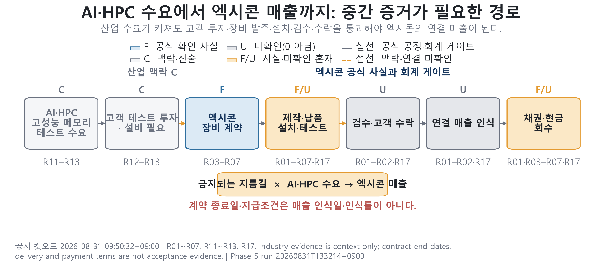

# 엑시콘 증거 중심 기업분석

OpenDART 공시와 공식 시장자료를 바탕으로 엑시콘(코스닥 092870)의 수주가 매출·이익·현금흐름으로 전환되는 과정을 추적한 기업분석 프로젝트입니다. 확인할 수 없는 값은 임의로 채우지 않고 `U`로 유지하며, 원자료부터 차트와 최종 보고서까지의 데이터 계보와 SHA-256 해시를 함께 보존합니다.

> 분석 기준: 공시 2026-08-31 09:50 KST · 시장가격 2026-08-28 종가 · 재무 2026-06-30<br>
> 최신 정기공시: 2026년 반기보고서, 접수번호 `20260814001521`<br>
> 이 저장소의 결과는 투자 권유, 투자의견 또는 목표주가가 아닙니다.

## 바로 보기

- [최종 기업분석 보고서](03_엑시콘_기업분석_보고서.md)
- [최종 PDF 보고서](output/pdf/03_엑시콘_기업분석_보고서.pdf)
- [프로젝트 결과보고서](YIG_엑시콘_프로젝트_결과보고서_2026-08-31.md)
- [시각화 검증서](05_엑시콘_Phase5_시각화_검증.md)
- [분석 한계와 업데이트 체크리스트](05_엑시콘_분석한계와_업데이트체크리스트.md)
- [최종 산출물·해시 매니페스트](YIG_엑시콘_최종산출물_매니페스트_2026-08-31.json)



## 프로젝트가 답하는 질문

핵심 질문은 “반도체 테스트 산업의 구조적 순풍 속에서 엑시콘은 어디에 위치하며, 2026년 대형 수주가 매출·이익·현금흐름으로 얼마나 전환됐는가?”입니다.

현재 스냅샷의 결론은 다음과 같습니다.

| 항목 | 판정 |
|---|---|
| 영업 실적 | 2026년 2분기 매출·영업이익 회복 확인 |
| 현금 전환 | 재고·채권 증가와 상반기 음의 영업현금흐름으로 아직 미완료 |
| 계약별 수익 인식 | 검수·고객 수락·연결매출 귀속 증거가 없어 `U` |
| 가치평가 | 현재 EV는 계산했지만 동질 Peer 배수 부재로 목표가격은 `U` |

분석에는 아래의 증거 상태를 일관되게 사용합니다.

| 상태 | 의미 |
|:---:|---|
| `F` | 정기공시·계약공시·공식 시장자료에서 직접 확인한 사실 |
| `C` | 산업·회사 설명 등 방향성을 이해하기 위한 맥락 |
| `E` | 확인된 원자료의 차감·비율·기계 계산 |
| `M` | 다음 공시에서 확인할 사건, 방법론 또는 전이 조건 |
| `U` | 공개 증거로 확인할 수 없는 값이나 상태 |

`U`는 0, 평균, 임의 확률 또는 임의 인식률로 대체하지 않습니다. 연결·별도, 누적·독립 분기, 계약가치·기납품·매출 인식도 서로 분리합니다.

## 데이터 파이프라인

```text
OpenDART 공시·재무·주식·원문
              │
              ▼
Phase 2 수집 ── 정규화·자동 검산
              │
              ├── 최신 공시 게이트
              └── KIND 시장 스냅샷
                        │
                        ▼
Phase 3 Historical·계약 증거
              │
              ▼
Phase 4 조건부 전망·사건 시나리오·시장가치
              │
              ▼
Phase 5 차트 데이터 ── PNG 11종 ── Markdown/PDF ── 최종 해시 매니페스트
```

| 단계 | 주요 스크립트 | 핵심 출력 |
|---|---|---|
| 원자료 수집 | `collect_opendart_phase2.ps1` | 공시·재무·주식 JSON, 공시 원문 ZIP/XML, 수집 매니페스트 |
| 정규화 | `normalize_opendart_phase2.py` | CFS/OFS 재무행, 계약 원장, 주식 자료, 자동 검사 |
| 최신성 게이트 | `collect_opendart_phase3_gate.ps1` | 새 정기공시·계약 정정·해지 여부 |
| Historical | `build_phase3_historical.py` | 독립 분기 실적과 계약 타이밍 증거 |
| 시장 스냅샷 | `collect_phase4_market.py` | KIND 관측값, KRX 응답, 네이버 종가 교차검증 |
| 조건부 모델 | `build_phase4_conditional_model.py` | 마진 드라이버, 사건 시나리오, 시장가치 자기진단 |
| 차트팩 | `build_phase5_chartpack.py`, `render_phase5_chartpack.py` | 차트 데이터, PNG 11종, 레이아웃 검사 |
| 최종 포장 | `build_final_report_pdf.py`, `build_final_artifact_manifest.py` | A4 PDF, 산출물·입출력 해시 매니페스트 |

각 모델 실행은 타임스탬프가 붙은 run 디렉터리와 입력·출력 해시를 남깁니다. Phase 5는 선택한 Phase 4와 공시 게이트의 계보 및 최신성을 다시 검사합니다.

## 저장소 구조

```text
.
├── 01_...md ~ 05_...md       # 단계별 분석·검증 문서
├── 03_엑시콘_기업분석_보고서.md  # 최종 Markdown 보고서
├── YIG_...md/json            # 계획서, 작업로그, 결과보고서, 최종 매니페스트
├── scripts/                  # 수집·정규화·모델·렌더·PDF 스크립트
├── figures/                  # Phase 3~5 차트 16종
├── output/pdf/               # 최종 17쪽 PDF
├── raw/                      # 로컬에서 생성되는 원자료와 run 데이터, Git 제외
├── requirements-chartpack.txt
└── requirements-report.txt
```

`raw/`와 `.env`는 민감정보 및 대용량 원자료 보호를 위해 Git에서 제외됩니다. 따라서 새 clone에서도 최종 Markdown·PNG·PDF는 바로 볼 수 있지만, 전체 파이프라인을 다시 실행하려면 OpenDART API 키로 원자료를 재수집해야 합니다.

## 실행 환경

이 프로젝트는 다음 환경에서 검증했습니다.

- Windows PowerShell 5.1
- CPython 3.12.10
- `lxml`(현재 로컬 환경 6.1.1, requirements 미고정)
- `matplotlib==3.11.1`, `numpy==2.5.2`, `Pillow==12.3.0`
- `reportlab==5.0.1`
- OpenDART API 키와 인터넷 연결
- PDF 생성용 Windows 맑은 고딕(`malgun.ttf`, `malgunbd.ttf`)

### 설치

PowerShell에서 저장소 루트를 기준으로 실행합니다.

```powershell
py -3.12 -m venv .venv
.\.venv\Scripts\Activate.ps1
python -m pip install --upgrade pip
python -m pip install -r requirements-chartpack.txt -r requirements-report.txt
python -m pip install lxml==6.1.1
```

`lxml`은 정규화 스크립트에 필요하지만 현재 두 requirements 파일에는 포함되어 있지 않아 별도로 설치합니다.

### OpenDART 설정

저장소 루트에 `.env`를 만들고 아래 값을 입력합니다. API 키는 따옴표 없이 넣으며 커밋하지 않습니다.

```dotenv
DART_API_KEY=YOUR_40_CHARACTER_OPENDART_KEY
DART_BASE_URL=https://opendart.fss.or.kr/api
DART_CORP_CODE=00611736
DART_STOCK_CODE=092870
DART_BGN_DATE=20230101
DART_RAW_DIR=raw/dart
DART_DISCLOSURE_LIST_ENDPOINT=/list.json
DART_COMPANY_ENDPOINT=/company.json
DART_FINANCIALS_ALL_ENDPOINT=/fnlttSinglAcntAll.json
DART_STOCK_TOTAL_ENDPOINT=/stockTotqySttus.json
DART_TREASURY_STOCK_ENDPOINT=/tesstkAcqsDspsSttus.json
DART_CAPITAL_CHANGE_ENDPOINT=/irdsSttus.json
DART_MAJOR_HOLDER_ENDPOINT=/hyslrSttus.json
DART_MAJOR_HOLDER_CHANGE_ENDPOINT=/hyslrChgSttus.json
```

수집 매니페스트에는 API 키와 요청 인증값을 기록하지 않습니다.

## 2026-08-31 스냅샷 재실행

아래 순서는 현재 보고서의 데이터 범위를 다시 만드는 예시입니다. OpenDART 수집 시 API 호출이 발생하며, 시장가격과 상장주식 수는 KIND에서 직접 확인한 뒤 입력해야 합니다.

```powershell
# 1. OpenDART 원자료 수집 및 정규화
.\scripts\collect_opendart_phase2.ps1 -CutoffDate 20260831
python .\scripts\normalize_opendart_phase2.py

# 2. 같은 cutoff의 최신 공시 게이트 생성
.\scripts\collect_opendart_phase3_gate.ps1 `
  -StartDate 20260101 `
  -EndDate 20260831 `
  -BaselineFile raw/dart/disclosures_20260101_20260831.json

# 3. 독립 분기 Historical과 계약 증거 생성
python .\scripts\build_phase3_historical.py
python .\scripts\render_phase3_figures.py

# 4. KIND 관측값을 기록하고 네이버 일별 종가와 교차검증
$kindObservedAt = (Get-Date).ToString('yyyy-MM-ddTHH:mm:sszzz')
python .\scripts\collect_phase4_market.py `
  --trade-date 2026-08-28 `
  --kind-close 25900 `
  --kind-listed-shares 13050797 `
  --kind-observed-at $kindObservedAt

# 5. 최신 Phase 3·시장 스냅샷으로 조건부 모델 생성
python .\scripts\build_phase4_conditional_model.py
python .\scripts\render_phase4_figures.py

# 6. 최신 Phase 4 계보로 차트 데이터와 PNG 11종 생성
python .\scripts\build_phase5_chartpack.py
python .\scripts\render_phase5_chartpack.py

# 7. 최종 PDF 생성
python .\scripts\build_final_report_pdf.py
```

Phase 3·4 빌더는 기본적으로 가장 최신 입력 run을 선택합니다. Phase 5는 공시 게이트가 기본 24시간보다 오래되면 중단합니다. `--allow-stale-inputs`는 과거 계보를 의도적으로 재현할 때만 사용하세요.

최종 산출물 매니페스트는 공시 게이트, Phase 3~5 run 경로를 명시적으로 받습니다.

```powershell
python .\scripts\build_final_artifact_manifest.py --help
```

이 단계는 자동 렌더 매니페스트 외에 수동 시각 QA 기록과 저장소 밖의 대화형 HTML도 확인하므로, 새 clone에서는 추가 파일 없이 바로 실행되지 않습니다.

## 검증과 재현성

2026-08-31 최종 계보의 검사 결과입니다.

| 검사 | 결과 |
|---|---:|
| Phase 2 정규화 | 208 / 208 PASS |
| Phase 3 Historical·계약 | 47 / 47 PASS |
| Phase 4 조건부 모델·시장가치 | 138 / 138 PASS |
| Phase 5 차트 데이터 | 132 / 132 PASS |
| Phase 5 PNG 자동 렌더 | 77 / 77 PASS |
| Phase 5 수동 시각 QA | 11 / 11 PASS |
| PDF 페이지 육안 QA | 17 / 17 PASS |

자동 검사에는 원자료 합계 대사, 누적·독립 분기 계산, 계약 정정 연결, 시장가치 산식, 입력 해시, 비밀값 비노출, 이미지 크기·용량·A4 글꼴 크기·텍스트 잘림·겹침 검사가 포함됩니다. 실패가 있으면 해당 빌더가 0이 아닌 종료 코드 또는 예외로 중단합니다.

최종 산출물과 입력 계보의 개별 SHA-256은 [최종 매니페스트](YIG_엑시콘_최종산출물_매니페스트_2026-08-31.json)에서 확인할 수 있습니다.

## 새 공시로 업데이트할 때

단순히 cutoff만 바꾸기 전에 [업데이트 체크리스트](05_엑시콘_분석한계와_업데이트체크리스트.md)에 따라 다음 순서를 지킵니다.

1. 새 정기공시·계약 정정·해지 여부를 최신성 게이트로 확인합니다.
2. 원문과 정규화 계층을 다시 만들고 CFS/OFS 및 누적/분기 기준을 대사합니다.
3. 계약별 검수·수락·매출 귀속 증거가 생겼는지 확인합니다.
4. Phase 3~5를 새 run으로 실행하고 자동·수동 QA를 완료합니다.
5. 보고서, 작업로그, PDF와 최종 해시 매니페스트를 함께 갱신합니다.

수집기의 기간 행렬과 일부 공시 접수번호, 보고서 본문 및 PDF 구성은 현재 2026년 반기 스냅샷에 맞춰져 있습니다. 2026년 3분기 이후 자료를 반영할 때는 날짜만 바꾸지 말고 해당 가정과 소스 매핑도 함께 수정해야 합니다.

## 알려진 제한사항

- `raw/`와 `.env`는 Git에 포함되지 않으므로 API 키 없이 원자료 계층을 재구성할 수 없습니다.
- PDF 빌더는 Windows의 맑은 고딕 절대경로를 사용하며 Markdown을 자동 변환하는 범용 빌더가 아닙니다.
- 최종 매니페스트 빌더는 `C:\Users\kuri\OneDrive\com.rea-visualizations\exicon-evidence-state.html`을 참조하므로 다른 환경에서는 경로 수정이 필요합니다.
- 계획된 XLSX 산출물 3종은 전용 스프레드시트 런타임 부재로 현재 `BLOCKED` 상태입니다. 분석 내용은 JSON·Markdown·PNG·PDF로 보존되어 있습니다.
- 별도 테스트·CI·배포 환경은 없으며, 각 단계의 데이터 및 렌더 검사가 검증 장치 역할을 합니다.
- 별도 라이선스가 지정되어 있지 않습니다. 외부 재사용 전 권리 조건을 확인하세요.

## 관련 문서

- [기업분석 보고서 구현계획서](YIG_엑시콘_기업분석_보고서_구현계획서.md)
- [전체 작업 로그](YIG_엑시콘_기업분석_작업로그.md)
- [Phase 1 기준일·최신성 점검](01_엑시콘_Phase1_기준일_최신성점검.md)
- [Phase 2 소스로그·원자료](02_엑시콘_Phase2_소스로그_원자료.md)
- [Phase 3 Historical·계약 증거](03_엑시콘_Phase3_Historical_계약증거.md)
- [Phase 4 조건부 전망·시나리오·가치평가](04_엑시콘_Phase4_조건부전망_시나리오_가치평가.md)
